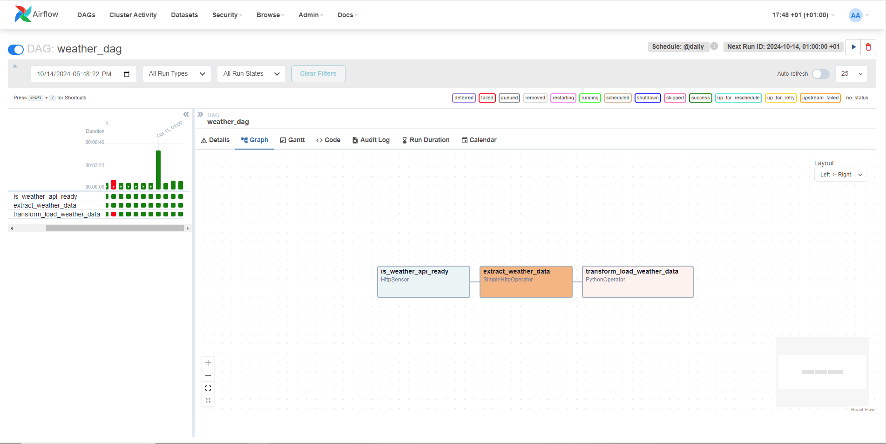
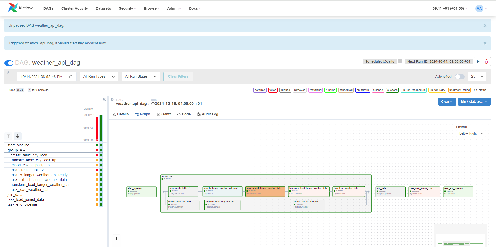

# what is airflow ?
- ```is an open-source platform for developing, scheduling, and monitoring batch-oriented workflows. Airflow’s extensible Python framework enables you to build workflows connecting with virtually any technology. A web interface helps manage the state of your workflows. Airflow is deployable in many ways, varying from a single process on your laptop to a distributed setup to support even the biggest workflows.```

# Download the airflow Docker Compose file
- install docker and docker-compose
- curl -LfO 'https://airflow.apache.org/docs/apache-airflow/2.9.0/docker-compose.yaml'
- mkdir -p ./dags ./logs ./plugins ./config
- docker compose up airflow-init
- docker compose up -d
- docker compose ps


# Examples :
#### weather API DAG


#### weather API DAG 2



# what is snowflake ?
- Snowflake is a cloud data warehouse that can store and analyze all your data records in one place. It can automatically scale up/down its compute resources to load, integrate, and analyze data.


# what is an ETL process ?
- ```
    - E=Extract: Extracting data from a source
    - T=Transformation: transformating data into the format for the output
    - L=Load: loading data into a database , data warehouse or other storage
    ```

## what is Extraction
- configuring access to data and reading it into an application
- web scraping
- connecting programmatically via APIs
- the data may be static or streaming online

## what is data transformation ?
- processing data
- conforming to target systems and use cases
- cleaning
- filtering
- joining
- feature engineering
- formatting and data typing

## what is data loading ?
- moving data into a new environment
- making the data readily available for analytics, dashboards, reports


# differences between ETL and ELT
### whene and where the transformation happen:
    - Transformations for ETL happen within the data pipeline
    - transformation for ELT happen in the destination environment
### flexibility
    - ETL is rigid: pipeline are engineered to user specifications
    - ELT is flexible: end users build their own transformations
### support for Big Data
    - organization use ETL for relational data, on-premise: scalabilty is difficult
    - ELT solves scalability problems, handling both strctured and unstructured Big Data in the cloud
### Time-to-insight
    - ETL workflows take time to specify and develop
    - ELT supports self-service, interactive analytics in real-time

# what is a pipeline ?
- series of connected processes
- the output of one process is the input of the next
- for example, take a box , pass it to your neighbor, and so on , until the box arrives at the end of the line
- mass production: parts pass along conveyor belts between manufacturing stages